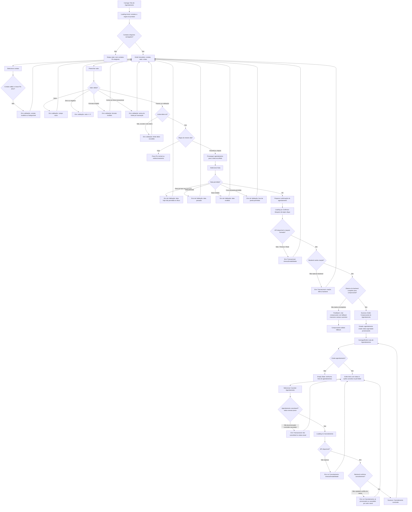

```mermaid
graph TD
classDef error fill:#f96,stroke:#333,stroke-width:2px;
classDef success fill:#9f6,stroke:#333,stroke-width:2px;
classDef loading fill:#eef,stroke:#333,stroke-width:2px;

A[Carregar Tela de Agendamento] --> B[Loading inicial: contatos e regras do produto]
B --> C{Contatos elegíveis carregados?}
C -->|Não| D[Empty state: sem contatos Pix elegíveis]
C -->|Sim| E[Exibir formulário: contato, valor e data]

E --> F[Selecionar contato]
F --> G{Contato válido e chave Pix ativa?}
G -->|Não| H[Erro validação: contato inválido ou indisponível]
H --> E

E --> I[Preencher valor]
I --> J{Valor válido?}
J -->|Vazio| K[Erro validação: campo vazio]
J -->|Zero ou negativo| L[Erro validação: valor <= 0]
J -->|Formato inválido| M[Erro validação: formato inválido]
J -->|Acima do limite transacional| N[Erro validação: acima do limite por transação]
J -->|Passou na validação| O{Limite diário ok?}
K --> E
L --> E
M --> E
N --> E

O -->|Não, excede o teto diário| P[Erro validação: limite diário excedido]
P --> E
O -->|Sim| Q{Regra do mesmo dia?}
Q -->|Hoje| R[Fluxo Pix normal ou redirecionamento]
Q -->|Amanhã ou depois| S[Prosseguir agendamento para a data escolhida]

S --> T[Selecionar Data]
T --> U{Data permitida?}
U -->|Data de hoje com bloqueio| V[Erro de Validação: data hoje não permitida no fluxo]
U -->|Data passada| W[Erro de Validação: data passada]
U -->|Data inválida| X[Erro de Validação: data inválida]
U -->|Fora da janela permitida| Y[Erro de Validação: fora da janela permitida]
U -->|OK| Z[Preparar confirmação do agendamento]
V --> E
W --> E
X --> E
Y --> E

Z --> AA[Loading ao Confirmar: bloqueio de duplo clique]
AA --> AB{API disponível e request formada?}
AB -->|Não / Timeout / Rede| AC[Erro Transacional: timeout/instabilidade]
AB -->|Sim| AD{Backend aceita criação?}
AD -->|Não rejeicao backend| AE[Erro Transacional: criação falhou backend]
AD -->|Sim| AF{Retorno do backend completo para comprovante?}

AF -->|Não dados incompletos| AG[Feedback: criar comprovante com fallback mascarar campos ausentes]
AF -->|Sim| AH[Sucesso: Exibir Comprovante do Agendamento]
AG --> AI[Comprovante exibido fallback]
AH --> AJ[Estado: agendamento criado status agendado processando]

AC --> E
AE --> E

AJ --> AK[Carregar/Exibir Lista de Agendamentos]
AK --> AL{Existe agendamento?}
AL -->|Não| AM[Empty State: nenhuma lista de agendamentos]
AL -->|Sim| AN[Exibir itens com status e ações cancelar se permitido]

AN --> AO[Selecionar Cancelar Agendamento]
AO --> AP{Agendamento cancelavel? status sessao prazo}
AP -->|Não já processado concluido cancelado| AQ[Erro Transacional: não cancelável no status atual]
AP -->|Sim| AR[Loading no Cancelamento]
AR --> AS{API disponível?}
AS -->|Não rejeicao| AT[Erro no Cancelamento: timeout/instabilidade]
AS -->|Sim| AU{Backend confirma cancelamento?}
AU -->|Não rejeitado conflito de status| AV[Erro no Cancelamento: já processado ou cancelado por outro canal]
AU -->|Sim| AW[Sucesso: Cancelamento concluído]
AQ --> AN
AT --> AN
AV --> AN
AW --> AK


```
